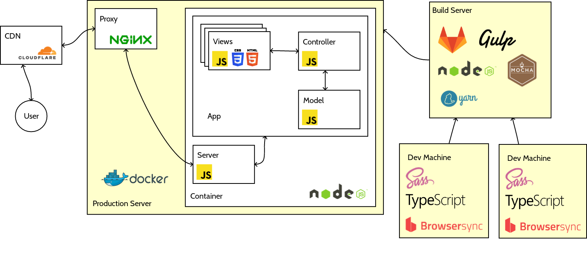
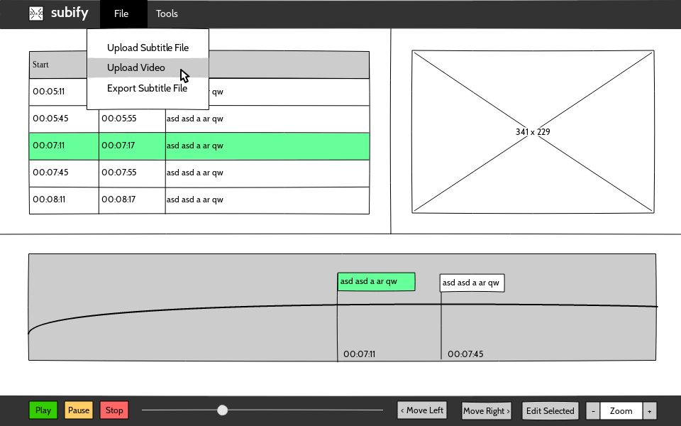

# Subify system architecture

**Group A8** Matteo Nardini (13414), Remo Scolati (13389)

## Introduction

* Online Webapp
    * Create, edit, synchronise and fix subtitles
* Every operation done locally
    * No files are ever uploaded remotely
* Target platforms are desktop and tablet

## Architecture

* Backend with limited set of functionalities
    * Routing and static assets
    * HTML preprocessing
* Frontend
    * Will account for most of the work
* Focus will be on Frontend and CI/CD tools

## Architecture and Technology Overview

## Backend

* Nodejs
    * Server written in TypeScript
        * Adds static analysis and typing to Javascript
    * EJS for HTML preprocessing

## Wireframes

## Frontend

* HTML5, CSS3
* Javascript
    * Web Audio API
    * WebGL API
    * ES2015 Modules